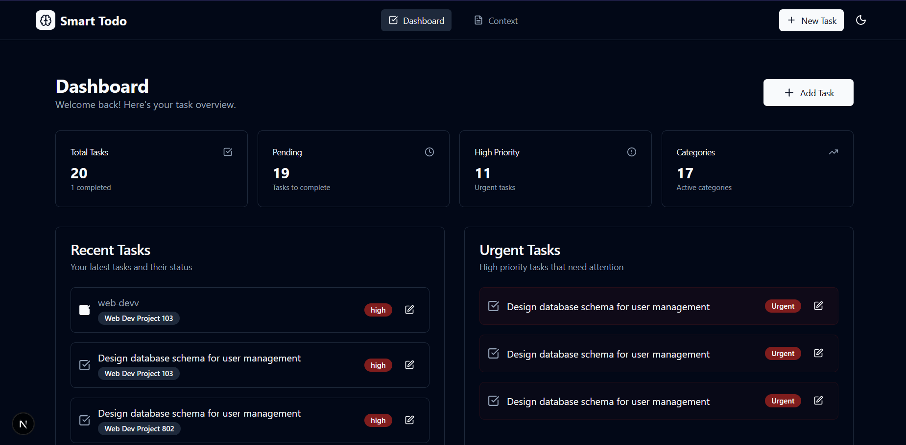
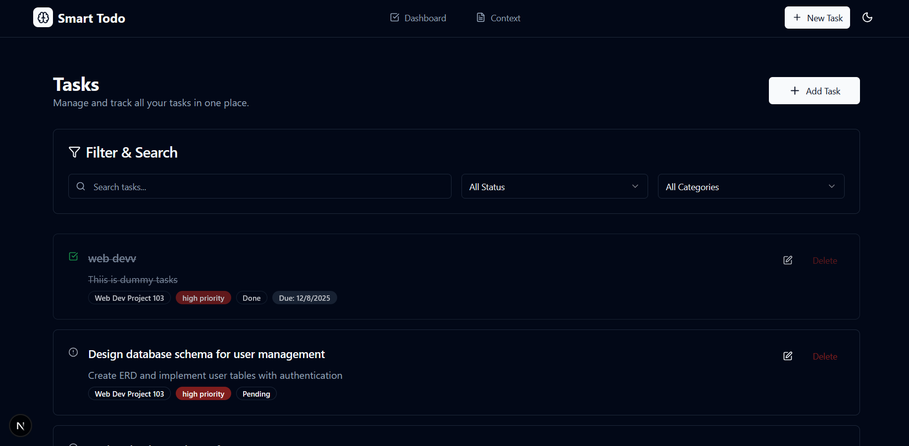
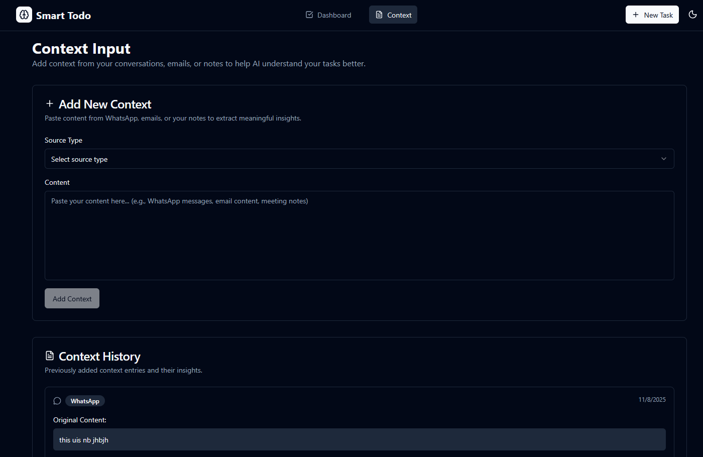
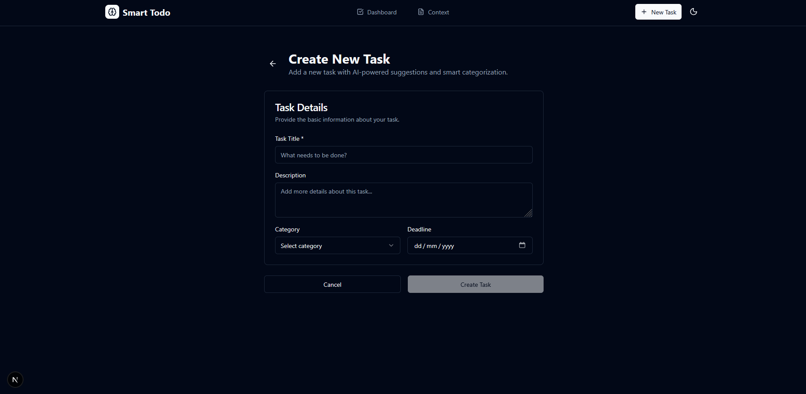
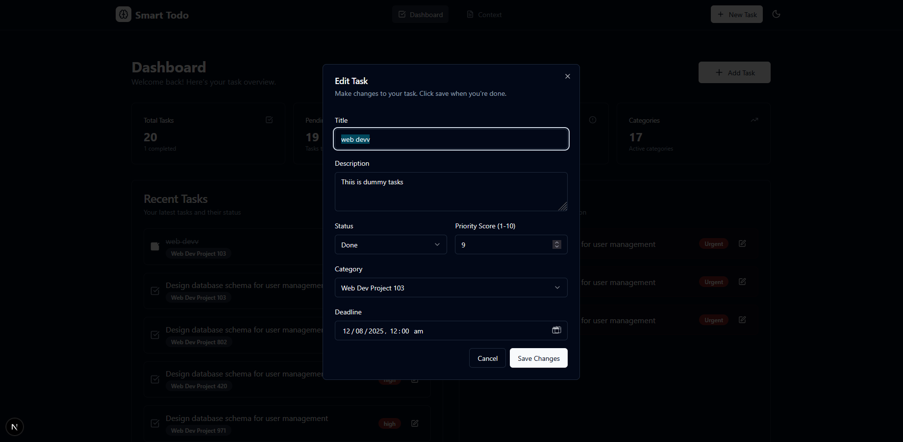

# 📝 Smart Todo List - Next.js Frontend

A modern, responsive frontend for the Smart Todo List application built with Next.js 15, featuring AI-powered task management, real-time updates, and a beautiful user interface.

## 🚀 Features

### Core Frontend Features
- **Modern UI/UX**: Beautiful, responsive design with Tailwind CSS
- **Real-time Updates**: Live synchronization with backend API
- **Interactive Dashboard**: Task statistics, recent tasks, and urgent task highlighting  
- **Smart Task Management**: Create, edit, delete tasks with inline editing
- **AI Context Analysis**: Process WhatsApp, Email, and Notes for intelligent insights
- **Dark/Light Themes**: Automatic theme switching support
- **Mobile-First**: Fully responsive design for all devices
- **Type Safety**: Complete TypeScript implementation
- **State Management**: Zustand with persistence

### UI Components
- **Task Cards**: Interactive, clickable task containers with hover effects
- **Edit Dialog**: Modal-based task editing with form validation
- **Context Input**: Multi-source context processing interface
- **Statistics Dashboard**: Real-time task metrics and insights
- **Loading States**: Smooth user experience with loading indicators
- **Toast Notifications**: User-friendly feedback for all actions

## 🛠️ Tech Stack

- **Next.js 15.0.4** - React framework with App Router
- **TypeScript 5** - Type safety and developer experience
- **Tailwind CSS 3.4.1** - Utility-first styling framework
- **shadcn/ui** - Modern component library with Radix UI
- **Zustand 5.0.2** - Lightweight state management
- **Axios 1.7.7** - HTTP client for API communication
- **Sonner** - Beautiful toast notifications
- **Lucide React** - Modern icon system
- **React Hook Form** - Form handling and validation

## 🖼️ Screenshots

### Dashboard - Home Page


*Features real-time task statistics, recent task overview, and urgent task highlighting*

### Task Management Page  



*Complete task management with search, filtering, and inline editing*

### Context Analysis Page


*AI-powered context analysis from WhatsApp, Email, and Notes*

### Task Creation & Editing



*Comprehensive task editing with real-time updates*

## 📋 Prerequisites

- **Node.js 18.0+** (LTS recommended)
- **npm 9.0+** or **yarn 1.22+**
- **Backend API** running at `http://127.0.0.1:8001`

## 🚀 Quick Setup

### 1. Install Dependencies
```bash
npm install
```

### 2. Environment Configuration
Create `.env.local` file:
```env
# Backend API Configuration
NEXT_PUBLIC_API_BASE_URL=http://127.0.0.1:8001/api

# Optional: Analytics & Monitoring
NEXT_PUBLIC_APP_ENV=development
```

### 3. Start Development Server
```bash
npm run dev
```

### 4. Access Application
- **Frontend**: http://localhost:3005
- **Backend API**: http://127.0.0.1:8001/api

## 🔧 Available Scripts

```bash
# Development
npm run dev          # Start development server
npm run build        # Build for production
npm run start        # Start production server
npm run lint         # Run ESLint
npm run type-check   # TypeScript type checking
```

## 🏗️ Project Structure

```
frontend/
├── src/
│   ├── app/                    # Next.js App Router
│   │   ├── globals.css        # Global styles
│   │   ├── layout.tsx         # Root layout
│   │   ├── page.tsx           # Dashboard page
│   │   ├── tasks/             # Task management pages
│   │   └── context/           # Context analysis pages
│   ├── components/            # Reusable UI components
│   │   ├── ui/               # shadcn/ui components
│   │   ├── EditTaskDialog.tsx # Task editing modal
│   │   └── ...               # Other components
│   └── lib/                  # Utilities and configurations
│       ├── store.ts         # Zustand state management
│       ├── api.ts           # API client functions
│       ├── utils.ts         # Helper functions
│       └── types.ts         # TypeScript type definitions
├── public/              # Static assets
├── package.json         # Dependencies and scripts
├── tailwind.config.js   # Tailwind configuration
├── next.config.ts       # Next.js configuration
└── tsconfig.json        # TypeScript configuration
```

## 📱 Key Features Implementation

### Real-time Task Statistics
```typescript
// Automatic calculation of task metrics
const stats = {
  total: tasks.length,
  completed: tasks.filter(t => t.status === 'Completed').length,
  pending: tasks.filter(t => t.status === 'Pending').length,
  inProgress: tasks.filter(t => t.status === 'In Progress').length
}
```

### Interactive Task Management
- **Clickable Containers**: Full task cards are clickable for editing
- **Inline Actions**: Quick status updates and priority changes
- **Modal Editing**: Comprehensive task editing in modal dialogs
- **Real-time Updates**: Immediate UI updates after API calls

### AI Context Processing  
- **Multi-source Input**: WhatsApp, Email, Notes processing
- **Structured Display**: AI insights shown as organized badges
- **Keyword Extraction**: Automatic keyword and theme identification
- **Smart Suggestions**: AI-powered task creation suggestions

### State Management
```typescript
// Zustand store with persistence
interface TaskStore {
  tasks: Task[]
  categories: Category[]
  contextEntries: ContextEntry[]
  fetchTasks: () => Promise<void>
  createTask: (task: CreateTaskDto) => Promise<void>
  updateTask: (id: number, task: Partial<Task>) => Promise<void>
  deleteTask: (id: number) => Promise<void>
}
```

## 🎨 UI/UX Features

### Design System
- **Color Scheme**: Consistent color palette with theme support
- **Typography**: Clear hierarchy with proper font scaling
- **Spacing**: Consistent spacing using Tailwind's spacing scale
- **Animations**: Smooth transitions and hover effects

### Responsive Design
- **Mobile-First**: Optimized for mobile devices
- **Tablet Support**: Responsive layout for tablet screens
- **Desktop**: Full desktop experience with proper scaling
- **Touch-Friendly**: Large touch targets for mobile devices

### Accessibility
- **Keyboard Navigation**: Full keyboard accessibility
- **ARIA Labels**: Proper screen reader support
- **Focus Management**: Clear focus indicators
- **Color Contrast**: WCAG 2.1 compliant color ratios

## 🔌 API Integration

### Backend Communication
```typescript
// API client configuration
const api = axios.create({
  baseURL: process.env.NEXT_PUBLIC_API_BASE_URL,
  headers: {
    'Content-Type': 'application/json',
  },
})

// Task API functions
export const tasksApi = {
  getAll: () => api.get<PaginatedResponse<Task>>('/tasks/'),
  create: (task: CreateTaskDto) => api.post<Task>('/tasks/', task),
  update: (id: number, task: Partial<Task>) => api.put<Task>(`/tasks/${id}/`, task),
  delete: (id: number) => api.delete(`/tasks/${id}/`),
}
```

### Error Handling
- **API Error Handling**: Comprehensive error catching and user feedback
- **Loading States**: Loading indicators for all async operations  
- **Toast Notifications**: User-friendly success/error messages
- **Retry Logic**: Automatic retry for failed requests

## 🧪 Testing & Development

### Development Tools
```bash
# Type checking
npm run type-check

# Linting
npm run lint

# Build validation
npm run build

# Development server with hot reload
npm run dev
```

### Browser Support
- **Modern Browsers**: Chrome, Firefox, Safari, Edge (latest versions)
- **Mobile Browsers**: iOS Safari, Android Chrome
- **JavaScript**: ES2020+ features with proper polyfills

## 🚀 Deployment

### Build for Production
```bash
npm run build
npm start
```

### Environment Variables for Production
```env
NEXT_PUBLIC_API_BASE_URL=https://your-api-domain.com/api
NEXT_PUBLIC_APP_ENV=production
```

### Deployment Platforms
- **Vercel** (recommended for Next.js)
- **Netlify**
- **AWS Amplify**
- **Railway**
- **Heroku**

### Production Checklist
- [ ] Configure production API URL
- [ ] Set up environment variables
- [ ] Enable production optimizations
- [ ] Configure CDN for static assets
- [ ] Set up monitoring and analytics
- [ ] Test responsive design on various devices

## 🔧 Configuration

### Next.js Configuration
```javascript
// next.config.ts
/** @type {import('next').NextConfig} */
const nextConfig = {
  experimental: {
    typedRoutes: true,
  },
  images: {
    domains: ['your-api-domain.com'],
  },
}
```

### Tailwind Configuration
```javascript
// tailwind.config.js
module.exports = {
  content: [
    './pages/**/*.{js,ts,jsx,tsx,mdx}',
    './components/**/*.{js,ts,jsx,tsx,mdx}',
    './app/**/*.{js,ts,jsx,tsx,mdx}',
  ],
  theme: {
    extend: {
      colors: {
        // Custom color palette
      },
    },
  },
  plugins: [require('tailwindcss-animate')],
}
```

## 🐛 Common Issues & Solutions

### API Connection Issues
```bash
# Check if backend is running
curl http://127.0.0.1:8001/api/tasks/

# Verify CORS configuration in backend
# Ensure CORS_ALLOWED_ORIGINS includes http://localhost:3005
```

### Build Issues
```bash
# Clear Next.js cache
rm -rf .next
npm run build

# Check TypeScript errors
npm run type-check
```

### Environment Variables
```bash
# Ensure .env.local exists and has correct values
echo "NEXT_PUBLIC_API_BASE_URL=http://127.0.0.1:8001/api" > .env.local
```

## 🤝 Contributing

1. Fork the repository
2. Create a feature branch: `git checkout -b feature-name`
3. Make your changes following the coding standards
4. Test your changes thoroughly
5. Run type checking: `npm run type-check`
6. Submit a pull request with detailed description

### Coding Standards
- Use TypeScript for all components
- Follow React best practices
- Use meaningful component and variable names
- Add proper error handling
- Include loading states for async operations
- Test on multiple devices and browsers

## 📄 License

This project is licensed under the MIT License.

## 🆘 Support

For issues and questions:
- Check that backend API is running at `http://127.0.0.1:8001`
- Verify environment variables are correctly set
- Test API endpoints directly using curl or Postman
- Check browser console for JavaScript errors
- Review Network tab for API call failures

